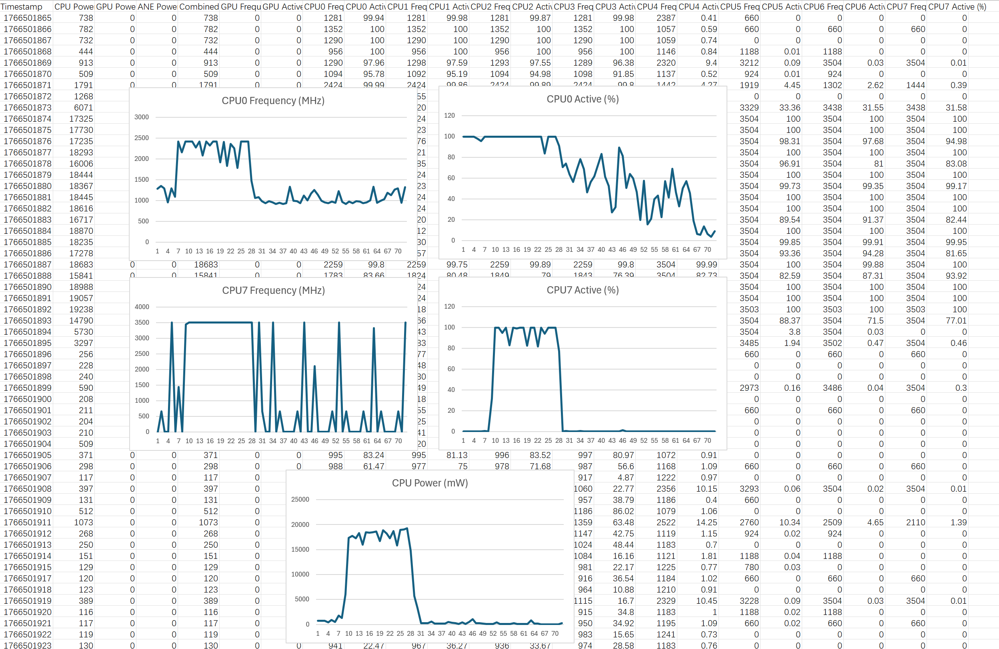

# Powermetrics to CSV Converting Tool for MacOS

## Features
- **Producer - Consumer Model** for concurrency, faster processing speed
- Using **re2** as regex engine, faster than **std::regex**
- Employs **polymorphic** parsers with a **factory design pattern**, providing scalability for adding new parsers
- Already embeded necessary dependencies as submodules, easy to build

## About

This is a tool to help you parse the output log of **powermetrics** and extract data from text message to a **csv** file, which can be further visualized using Excel or Tableau

**The data when compiling this project on M2 mac**


## Build

Prerequisites: cmake and a valid C++ compiler

Tested on **linux** with *gcc* and *clang*
Tested on **Windows** with *MSVC*

```
git clone https://github.com/void-512/PowermetricsToCSV.git
cd PowermetricsToCSV
git submodule update --init --recursive
mkdir build && cd build
cmake ..
cmake --build . --parallel
```

## Usage
1. Run ```sudo powermetrics -o samples.txt``` on MacOS to generate a powermetrics sample
2. ```./app sample.txt```, the program will generate *output.csv* as result

